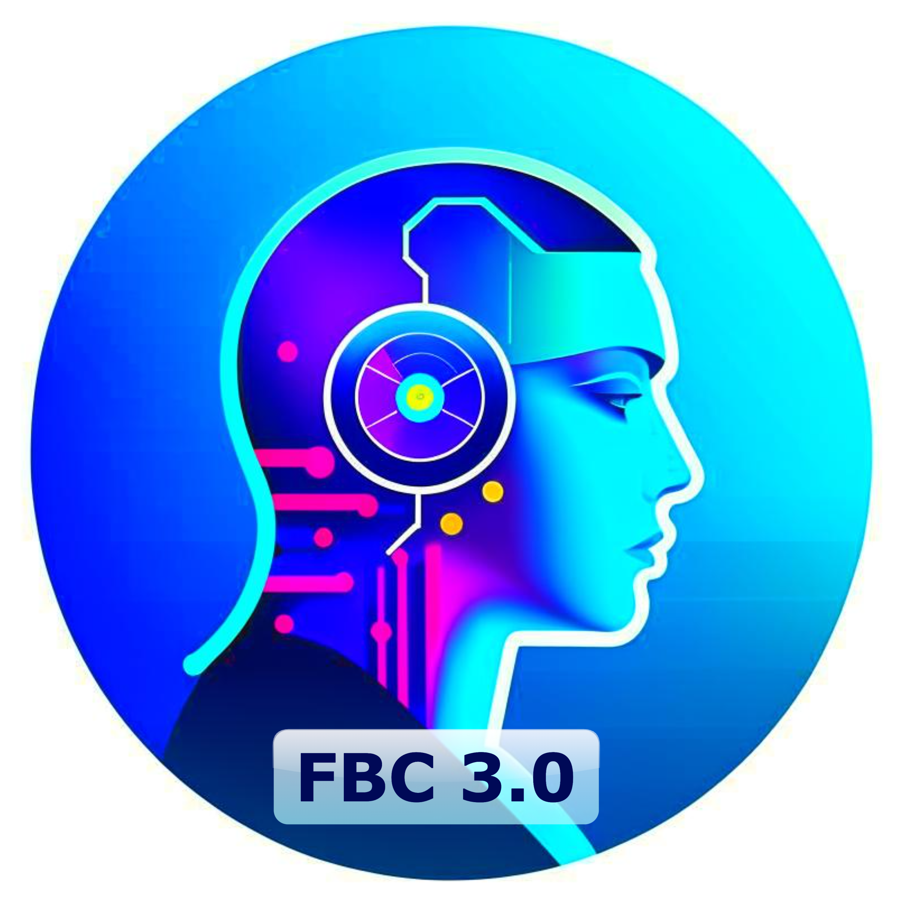
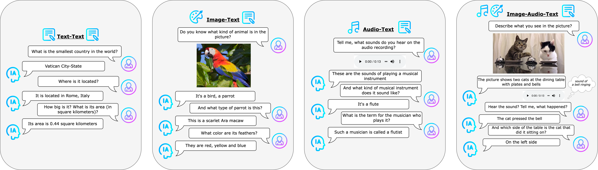
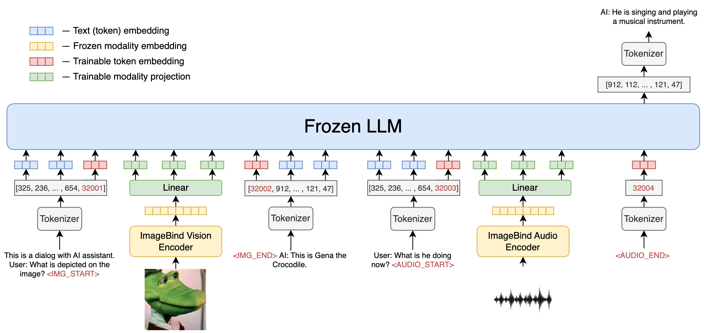

<div align="center">
  
</div>


# FusionBrain Challenge 3.0: Strong Intelligence

<div align="center">
 


</div>


## Содержание 📚
- [Общее описание задачи](#общее-описание-задачи-)
- [Данные](#данные)
- [Описание формата решения](#описание-формата-решения-)
- [Метрики](#метрики)
- [Ограничения](#ограничения-)
- [Baseline решение](#baseline-решение-)
- [Данные для обучения](#данные-для-обучения-)
- [Призовой фонд](#призовой-фонд-)
- [Специальная номинация](#специальная-номинация--что-где-когда--)

## Общее описание задачи 🚀
В рамках данного соревнования участникам предстоит 
разработать и обучить модель, способную вести мультимодальный 
диалог с пользователем. Модель должна уметь принимать на вход 
данные **трех модальностей: текстовая, визуальная и аудио**, 
анализировать их, учитывая в составе контекста диалога, и 
генерировать ответ на естественном (английском) языке. В
данном соревновании мы заранее не фиксируем список  задач,  
которые предстоит решать моделям участников. Вместо этого
участникам предлагается научить модель “понимать” любые 
данные из предложенного списка модальностей и “строить” 
на основе этих данных контекст диалога, что позволит решать 
неограниченный список задач в рамках трёх модальностей. 

Цель соревнования - проверить, насколько успешно модели, 
предложенные участниками, смогут справиться с извлечением 
информации и связыванием трех модальностей, а также 
поддержанием связного контекста на протяжении всего диалога.

Основным навыком, на основе которого будут сравниваться модели 
участников соревнования, будет **умение вести мультимодальный диалог 
с пользователем**, в котором модель выступает в виде полезного, 
вежливого и правдивого "Ассистента".

Однако, поскольку данная задача очень обширна, мы 
разделили все диалоги в ее рамках на несколько типов:
* **Текст-текст (Text+Text)** 📝+📝 <br>
Стандартные унимодальные диалоги, в которых как вопросы пользователя, так и ответы ассистента выражены в текстовом виде. Вопросы могут требовать от модели обладание знаниями о мире, а также способность учитывать контекст диалога.
* **Изображение-текст (Image+Text)** 🎨+📝 <br>
Бимодальные диалоги, в которых обязательно присутствует одно или несколько изображений и текстовые вопросы, для ответа на которые требуется произвести анализ изображения.
* **Аудио-текст (Audio+Text)** 🎼+📝 <br>
Бимодальные диалоги, в которых обязательно присутствует один или несколько аудиозаписей и текстовые вопросы, для ответа на которые требуется произвести анализ аудио.
* **Изображения-аудио-текст (Image+Audio+Text)** 🎨+ 🎼+📝 <br>
Трёхмодальные диалоги, которые объединяют все модальности, рассматриваемые в соревновании. В диалоге может встретиться одно или несколько изображений, а также одна или несколько аудиозаписей. Текстовые вопросы могут быть заданы по изображениям и аудио, присутствующим в диалогах. Вопрос может быть задан к одной модальности или сразу к обеим.

### Примеры диалогов 💬

Приведем несколько примеров к каждому из перечисленных типов диалоговых задач. В каждом из них Ассистенту нужно правдиво и 
вежливо ответить на разнообразные вопросы пользователя, используя все предоставленные в контексте диалога данные различных модальностей.

Диалоги составлены таким образом, чтобы максимально репрезентативно продемонстрировать способности модели понимать связи между модальностями, 
извлекать логические связи между высказываниями, сохранять контекст и строить полноценный диалог с человеком.

<div align="center">
  
</div>

## Данные

### Структура данных

Каждый диалог представляет собой список реплик, где реплика, в свою очередь, представлена списком словарей (каждый словарь описывает часть реплики).

В словаре поле **type** указывает тип данных (`text`, `image` или `audio`), **content** - непосредственное содержимое (например, текстовый вопрос, путь к изображению или аудио файлу).

В общем виде формат данных выглядит следующим образом:

Диалог - список списков ```[[реплика 1], [реплика 2], …, [реплика N]]```.

Реплика $i$ — список словарей ```[{"type": "type 1", "content": "content 1"}, {"type": "type 2", "content": "content 2"}, …, {"type": "type 1", "content": "content K"}]```.

**type** - тип данных из ```{’text’, ‘image’, ‘audio’}```.

**content** - сами данные (текст) или путь к ним (аудио, изображения).

**Пример:**

```
[[{"type": "text", "content": "What is the capital of Great Britain?"}], [{"type": "text", "content": "And what is the famous place there?"}], [{"type": "text", "content": "What is the most famous theater there?"}]]
[[{"type": "text", "content": "What is the capital of the country with the following hymn?"}], [{"type": "audio", "content": "path_to_the_audio"}], [реплика 2], [реплика 3]]
[[{"type": "image", "content": "path_to_the_image"}], [{"type": "text", "content": "What animal is on the picture?"}],[реплика N]]
```

В случае, когда в реплике присутствует модальность изображения или аудио, словарь может выглядеть следующим образом:

```[{"type": "text", "content": "What is the name of this mountain?"}, {"type": "image", "content": "path_to_the_image"}]```

```[{"type": "text", "content": "What kind of bird makes such a sound?"}, {"type": "audio", "content": "path_to_the_audio"}]```

Изображения, по которым нужно сделать предсказания, размещены в папке _images_. Внутри лежат файлы изображений в разных форматах.

Аудио файлы, по которым нужно сделать предсказания, размещены в папке _audios_. Внутри лежат аудиофайлы в разных форматах.

## Описание формата решения 📋️

В проверяющую систему необходимо отправить код, запакованный в ZIP-архив. Решения запускаются в изолированном окружении при помощи Docker. Время и ресурсы во время тестирования ограничены.

Для запуска решений можно использовать существующее окружение:

*  ```cr.msk.sbercloud.ru/aijcontest_official/fbc3_0:0.1``` — Dockerfile и requirements для данного образа приведены на вкладке Данные.

Обратите внимание, окружение, в котором запускается решение, не имеет доступ в Интернет. Все необходимые файлы (например, веса обученной модели) должны быть загружены в архив с решением или непосредственно в Docker-образ. Мы рекомендуем загружать все тяжелые файлы в Docker-образ, так как при загрузке больших архивов с решением на платформу возможны сбои.

Инструкция по сборке кастомного образа и его загрузке в Docker registry можно найти по ссылке.

Для успешного запуска решения в вашем образе обязательно должны быть доступны следующие модули и библиотеки: *json*, *jsonlines*, *typing*, *numpy*, *datetime*, *time*, *traceback* и *huggingface_hub*. 

Скрипт `run.py`, который запускается в окружении, является унифицированным и предоставляется организаторами соревнования. Этот скрипт недоступен участникам, однако, для его успешного запуска и генерации выходных файлов решение участника должно соответствовать следующим характеристикам:

* В корне архива с решением должен лежать пакет **team_code** (каталог, содержащий в себе другие каталоги и модули и файл `__init__.py`).

Помимо модулей и каталогов, необходимых для решения участника, каталог **team_code** должен обязательно содержать модуль `generate.py`, в котором должны быть реализованы 3 функции: `setup_model_and_tokenizer()`, `generate_text(model, tokenizer, cur_query_list, history_list=None)` и `get_ppl(model, tokenizer, cur_query_tuple, history=None)`.

Рассмотрим подробнее каждую из этих функций: их функционал, аргументы и возвращаемое значение.

* ```setup_model_and_tokenizer() -> model, tokenizer```

    Функция, отвечающая за инициализацию модели и токенизатора.

    Функция не принимает аргументы на вход, возвращает объекты модели и токенизатора.

* ```generate_text(model: object, tokenizer: object, cur_query_list: List[Dict], history_list: List[Tuple[List[Dict], str]]) -> str```

    Функция, отвечающая за генерацию текстового ответа по входной реплике (**cur_query_list**) и истории диалога (**history_list**). Функция возвращает ответ на текущую реплику (в текстовом виде), а также текущий контекст диалога в удобном для себя формате.

    В качестве аргументов функция принимает на вход объекты модели и токенизатора (возвращенные функцией `setup_model_and_tokenizer()`), текущую реплику – **cur_query_list** – в формате списка словарей, а также предыдущую историю диалога до текущей реплики – **history_list** – в формате кортежа, в которых первый элемент кортежа — это история предыдущего диалога, возвращаемая функцией generate_text, а второй элемент — ответ сгенерированный моделью в $i$-ом раунде диалога.

**cur_query_list** для $i$-го раунда диалога может выглядеть следующим образом:

```[{'type': 'text', 'content': 'Question i'},{'type': 'image', 'content': 'path_to_the_picture'}]```

**history_list** для $i$-го раунда диалога может выглядеть следующим образом:

```
[
([{'type': 'text', 'content': 'content'}], 'Answer 1'), ([{'type': 'audio', 'content': 'content'}, .., {}], 'Answer 2'), 
…
([{'type': 'image', 'content': 'content'}, {}, {}, .., {}], 'Answer i-1')
]
```

* ```get_ppl(model: object, tokenizer: object, cur_query_tuple: Tuple[List[Dict], str], history_list: List[Tuple[List[Dict], str]]) -> float```
  
    Функция, которая возвращает значение перплексии для входной реплики с некоторым текстом (**cur_query_tuple**) и историей текущего диалога (**history**).

    В качестве аргументов функция принимает на вход объекты модели и токенизатора (возвращенные функцией `setup_model_and_tokenizer()`), текущую реплику с некоторым текстом – **cur_query_tuple** – в формате кортежа из списка словарей и текста, а также предыдущую историю диалога до текущей реплики – **history** – в формате кортежа, в которых нулевой элемент кортежа — это история предыдущего диалога, возвращаемая функцией get_ppl, а первый элемент — текстовый ответ в $i$-ом раунде диалога.

**cur_query_tuple** для $i$-го раунда диалога может выглядеть следующим образом:

```([{'type': 'text', 'content': 'Question i'},{'type': 'image', 'content': 'path_to_the_picture'}], 'text')```

**history_list** для $i$-го раунда диалога может выглядеть следующим образом:

```
[
([{'type': 'text', 'content': 'content'}], 'Answer 1'), ([{'type': 'audio', 'content': 'content'}, .., {}], 'Answer 2'), 
…
([{'type': 'image', 'content': 'content'}, {}, {}, .., {}], 'Answer i-1')
]
```

Данные функции с указанными списками аргументов и возвращаемыми значениями должны быть реализованы в модуле `generate` каталога **team_code**, при этом, их конкретная реализация зависит от участника.

Код участника не должен читать входные файлы, а также генерировать финальные файлы с ответами. Ответы, сгенерированные с помощью функций `generate_text` и `get_ppl` собираются в финальный файл в скрипте `run.py`, предоставленном организаторами соревнования.

## Метрики 

Оценка ответов участников производится по двум метрикам: генеративной и некоторой *скрытой* метрике. 
* Метрику оценки генерации ответов модели предлагается рассчитывать с применением **METEOR**, которая умножается на весовой коэффициент, в зависимости от типа диалога, к которому относится реплика. 
* Скрытая метрика основывается на **внутренней оценке уверенности модели в ответе**. Участникам предлагается, в рамках вычисления данной метрики, предоставлять численное значение перплексии модели в ответ на входные данные. В дальнейшем, показатель перплексии будет использоваться в расчете скрытой метрики.

Финальный результат участника и распределение мест будет оцениваться в соответствии с **интегральной метрикой**. <br>

Подробное описание метрик и их расчета можно почитать [тут](./METRICS.md).

## Ограничения ⚠️

В течение одних суток Участник или Команда Участников может загрузить для оценки не более 3 (трёх) решений. Учитываются только валидные попытки, получившие численную оценку. Если при расчете хотя бы одной метрики возникло исключение, решение считается невалидным, и счетчик попыток не уменьшается.

Контейнер с решением запускается в следующих условиях:

* 243 Gb RAM

* 16 CPU-cores

* 1 GPU Tesla A100 (80 Гб)

* время на выполнение решения: 3,5 часа

* решение не имеет доступ к ресурсам интернета

## Baseline решение 💡
За основу предлагается взять подходы [FROMAGe](https://github.com/kohjingyu/fromage) и [Kosmos-1](https://github.com/microsoft/unilm/tree/master/kosmos-2) для файнтюнинга линейного отображения из векторного пространства визуальной и аудио  модальностей в векторное пространство языковой модели-декодера и дальнейшей генерации ответа только с помощью языковой модели. В качестве энкодера дополнительных модальностей берётся CLIP-подобный энкодер [ImageBind](https://github.com/facebookresearch/ImageBind), обученный для задачи понимания  изображений, аудио и текста.

Веса энкодера и языковой модели в процессе обучения заморожены, за исключением дополнительных эмбеддингов для двух токенов начала и конца соответствующей модальности в языковой модели **\<SOM\>**, **\<EOM\>**.

Для обучения возможно использовать произвольные инструктивные и описательные датасеты, такие как аудиозаписи с субтитрами или вопросы по картинкам. В ходе обучения решается базовая задача предсказания следующего токена c архитектурой, описанной на схеме:

<p align="center">

</p>

1. Данные $y$ модальностей, кроме текстовой, переводятся в промежуточный эмбеддинг предобученным энкодером в эмбеддинг $v_\phi(y) \in \mathbb{R}^{m}$;
2. Линейным отображением $v_\phi(y)^\top\mathbf{W}, \mathbf{W} \in \mathbb{R}^{m \times kd}$ эмбеддинг переводится в $k$ векторов пространства языковой модели размерности $d$;
3. Токены, сигнализирующие о начале и конце данных соответствующей модальности, также имеют обучаемые эмбеддинги размерности $d$. В явном виде добавлять их в словарь модели не требуется.

## Данные для обучения  📚

Подробное описание предложеных для обучения датасетов можно почитать [тут](./DATASETS.md).

## Призовой фонд 🏆

* Первое место – 1 400 000 рублей
* Второе место – 900 000 рублей
* Третье место – 600 000 рублей
* Доп. номинация – 300 000 рублей

*До вычета НДФЛ

## Специальная номинация "Игра в эрудицию" 💎

В рамках соревнования FusionBrain Challenge 3.0 вводится дополнительная номинация для топ-10 команд на приватном лидерборде по основной номинации. 
В ней разработанные Участниками мультимодальные модели смогут принять участие в импровизированной игре на эрудицию 
и ответить на 10 сложных и интересных вопросов, подобных тем, что задаются знатокам в известной интеллектуальной игре.
Вопросы подаются в том же формате, что и для основной номинации. 
Вопросы комбинируют 2 (текст и изображения) или 3 (текст, изображения, аудио) модальности одновременно.
 
Модели нужно ответить на 10 вопросов в текстовом виде *с временными ограничениями* на каждый ответ. Каждый текстовый ответ оценивается Комиссией, в которую входят
Организатор и приглашенные эксперты. Такая оценка позволит точно определить, присутствует в сгенерированном моделью тексте правильный ответ, 
или нет. Таким образом, даже если модель провела некоторые рассуждения, после которых выдала правильный ответ, то Комиссия засчитает его.
 
За каждый правильный ответ модели присваивается 1 балл. В случае, если в ответе модели присутствовали правильные рассуждения, но финальный ответ оказался неверным, либо финальный ответ не был дан, команда получает 0.5 балла за раунд.
 
Дополнительная номинация присуждается той команде, модель которой дала больше всех правильных ответов. В случае равного количества баллов, преимущество отдается команде, чье решение отработало быстрее других, в случае совпадения баллов и времени решения победителем считается команда, которая занимает более высокое место на основном лидерборде.
