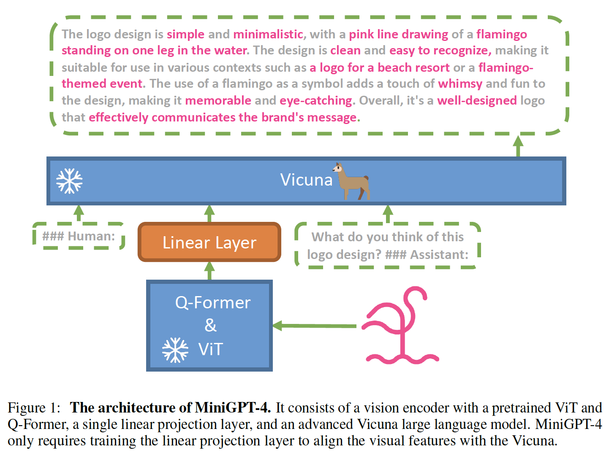
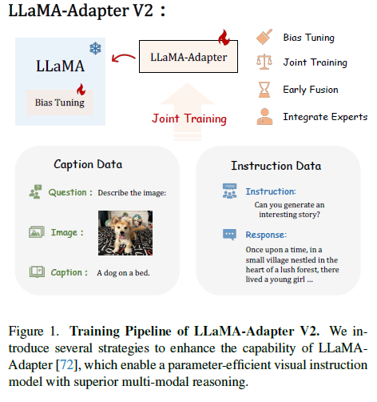

# The Survey of SoTA Multimodal Architectures (2023).

За последний год мы стали свидетелями стремительного развития больших языковых моделей 
(Large Language Models, LLMs), которые продемонстрировали уникальные интеллектуальные способности такие как: 
понимание, логическое рассуждение и обучение новым навыкам, аналогично тому, как сами люди получают 
и анализируют знания, рассуждают и принимают решения.

Обладая высоким уровнем интеллекта и возможностью интерактивно взаимодействовать с человеком, 
языковые модели позволяют создавать универсальные диалоговые системы, выполняющие инструкции пользователя. 

Однако задачи, которые ставит перед диалоговой системой человек не всегда заключаются только в естественном языке. 
Для того, чтобы раскрыть потенциальные возможности применения LLM за пределами одного лишь естественного языка, 
в ряде исследований, опубликованных в последние годы, были предприняты успешные попытки наладить взаимодействие 
языковых моделей с множеством разнообразных сигналов других модальностей (например, изображениями, видео, речью и аудио).
Таким образом, были предприняты попытки построения куда более умных и разноплановых диалоговых систем.

Поэтому, в качестве идейного вдохновения для создания модели умного мультимодального Ассистента мы предлагаем 
участникам ознакомиться с собранной нами подборкой SOTA мультимодальных архитектур 
на основе больших языковых моделей (Multimodal Large Language Models, MLLMs) за последний 2023 год.
С более ранними обзорами за 2021 и 2022 годы можно ознакомиться по ссылкам: [Survey MLLM 2021](https://github.com/ai-forever/fusion_brain_aij2021/blob/main/Papers%20on%20multitask%20%26%20multimodal%20models.md) и [Survey MLLM 2022](https://github.com/ai-forever/fbc2_aij2022/blob/main/Papers%20on%20multitask%20%26%20multimodal%20models.md).


## Surveys

Для начала мы предлагаем участникам самостоятельно ознакомиться с комплексными и наиболее полными обзорами текущего 
“ландшафта” разработки мультимодальных архитектур, которые были опубликованы за последние годы:

1. [Foundations and Trends in Multimodal Machine Learning: Principles, Challenges, and Open Questions](https://arxiv.org/abs/2209.03430) (```Paul Pu Liang, Amir Zadeh, Louis-Philippe Morency, Sep. 2022```) — эта статья предлагает верхнеуровневый обзор теоретических и практических основ мультимодальных языковых моделей через определение трех основополагающих аспектов объединения модальностей: гетерогенности (heterogeneity), связанности (connections) и взаимосвязи (interactions). Также предлагается таксономия из шести основных задач: представление данных (representation), согласованность между представлениями модальностей (alignment), рассуждение (reasoning), генерация (generation), способности к генерализации на новые задачи (transference) и масштабируемость модели на новые модальности (quantification), охватывающую исторические и последние тенденции.
2. [A Survey on Multimodal Large Language Models](https://arxiv.org/abs/2306.13549) (```Yin et. al., June 2023```) — в этой статье подробно описываются последние достижения в области MLLM (Multimodal Large Language Models) в разрезе четырех основных техник реализации подобных архитектур: Multimodal Instruction Tuning (M-IT), Multimodal In-Context Learning (M-ICL), Multimodal Chain of Thought (M-CoT), и LLM-Aided Visual Reasoning (LAVR). К каждому из описанных направлений собрана детальная таксономия с примерами реализа
3. [Multimodal Learning with Transformers: A Survey](https://arxiv.org/abs/2206.06488) (```Peng Xu, Xiatian Zhu, David A. Clifton, May 2023```) — эта статья предоставляет читателю полноценный обзор применения трансформерных моделей к мультимодальным данным. Она включает как основополагающее описание разнообразных трансформерных архитектур (от Vanilla Transformer и Vision Transformer  до более комплексных мультимодальных Transformers) и методов их предобучения, так и перечень возможных практических задач в рамках применения мультимодальных моделей.
4. [Multi-modal Machine Learning in Engineering Design: A Review and Future Directions](https://arxiv.org/abs/2302.10909) (```Binyang Song, Rui Zhou, Faez Ahmed, Feb. 2023```) — в данной статье подробно исследуются наиболее современные задачи применения мультимодальных моделей машинного обучения (Multimodal Models of Machine Learning, MMML) в разрезе пяти фундаментальных задач мультимодального обучения: мультимодальное представление данных (multi-modal information representation), объединение различных источников данных (fusion), согласованность между представлениями модальностей (alignment), перенос информации в рамках модальностей (translation), и объединенное обучение моделей на нескольких источниках сигналов разной природы (co-learning).

## SoTA Мультимодальные архитектуры

Далее, приводится краткий обзор основных опубликованных работ по теме мультимодальности (за период 2023 года), которые либо показали выдающееся качество решений по ряду задач и модальностей, либо привнесли в это поле исследований новые принципы построения архитектуры моделей.

1. [BLIP-2: Bootstrapping Language-Image Pre-training with Frozen Image Encoders and Large Language Models](#BLIP-2)
2. [FROMAGe: Grounding Language Models to Images for Multimodal Inputs and Outputs](#FROMAGe)
3. [Kosmos-1: Language Is Not All You Need Aligning Perception with Language Models](#Kosmos-1)
4. [MiniGPT-4: Enhancing Vision-Language Understanding with Advanced Large Language Models](#MiniGPT-4)
5. [LLaVA: Visual Instruction Tuning](#LLaVA)
6. [LLaMA-Adapter: Efficient Fine-tuning of Language Models with Zero-init Attention](#LLaMA-Adapter)
7. [LLaMA-Adapter V2: Parameter-Efficient Visual Instruction Model](#LLaMA-Adapter-V2)
8. [Otter: A Multi-Modal Model with In-Context Instruction Tuning](#Otter)
9. [ONE-PEACE: Exploring One General Representation Model Toward Unlimited Modalities](#ONE-PEACE)
10. [ImageBind: One Embedding Space To Bind Them All](#ImageBind)
11. [MultiModal-GPT: A Vision and Language Model for Dialogue with Humans](#MultiModal-GPT)
12. [InstructBLIP: Towards General-purpose Vision-Language Models with Instruction Tuning](#InstructBLIP)
13. [BuboGPT: Enabling Visual Grounding in Multi-Modal LLMs](#BuboGPT)
14. [IDEFICS & OBELICS: An Open Web-Scale Filtered Dataset of Interleaved Image-Text Documents](#IDEFICS)
15. [ImageBind-LLM: Multi-modality Instruction Tuning](#ImageBind-LLM)


**[BLIP-2: Bootstrapping Language-Image Pre-training with Frozen Image Encoders and Large Language Models](https://arxiv.org/abs/2301.12597)** (```Junnan Li, Dongxu Li, Silvio Savarese, Steven Hoi, 30 January 2023```) <a name="BLIP-2"></a>

**BLIP-2** (Bootstrapping Language-Image Pre-training with frozen unimodal models) - это обновленная версия модели BLIP ([BLIP: Bootstrapping Language-Image Pre-training for Unified Vision-Language Understanding and Generation](https://arxiv.org/abs/2201.12086)), которая была интересная тем, что сочетала в себе как дискриминативную, так и генеративную компоненты. 
Вторая версия модели идет в сторону уменьшения вычислительной стоимости обучения и повышения качества решений по ряду задач. 
Это осуществляется за счет двух основных идей:
* использовании заранее предобученных и, в последствии, замороженных визуальных и языковых моделей 
* и реализации эффективной кросс-модальной связи через использование связующего слоя новой архитектуры: **Querying Transformer (иначе Q-Former)**, который играет ключевую роль при адаптации визуальных эмбеддингов во входное векторное пространство языковой модели.

<div align="center">
 
</div>

Архитектура Q-Former из двух подмодулей (каждый представляет собой стек трансформерных слоев): <br>
* визуальный модуль, который взаимодействует с “замороженным” визуальным энкодером и извлекает ключевую информацию из векторных представлений изображений <br>
* текстовый модуль, который работает с текстовыми данными, выполняя работу как энкодера, так и декодера.
Оба подмодуля объединены общими весами (shared weights) в матрицах в self-attention блоков трансформера, к которым применяется дополнительное маскирование, в случае, если нужно работать только с одним типом данных. <br>

<div align="center">
 
</div>

Обучение всем модели BLIP-2 заключается в обучении исключительно Q-Former-а и разделяется на два этапа: 
1) **Vision and Language pretraining** - в рамках которого, используются две функции потерь (Image-Text Contrastive Learning (ITC), Image-Text Matching (ITM)), призванные обучить модель сопоставлять изображение и текст. Помимо это применяется отдельная функция потерь (Image-grounded Text Generation (ITG)) направленная на генерацию текста на основе картинки. В этой стадии используется только визуальный энкодер, веса которого замороженны, а в слое Q-former обучаются оба подмодуля.
2) **Vision-to-Language Generative Learning** - на полученная на прошлом этапе модель Q-Former, вместе с визуальным энкодером, соединяется с предобученной “замороженной” языковой моделью (LLM). На этом шаге Q-Former обучается созданию таких выходных представлений, которые могли бы быть правильно интерпретированы языковой моделью для решения конечных задач (со стандартной Cross-Entropy Loss).
со Cross-Entropy Loss для решения конечных задач.

Авторы статьи провели эксперименты с двумя семействами языковых моделей: с decoder-based LLMs (OPT) и с encoder-decoder-based LLMs (FlanT5), а в качестве визуального энкодера использовали две конфигурации на основе архитектуры ViT (Vision Transformer): ViT-L/14 из CLIP и ViT-G/14 из EVA-CLIP.


**[FROMAGe: Grounding Language Models to Images for Multimodal Inputs and Outputs](https://arxiv.org/abs/2301.13823)** (```Jing Yu Koh, Ruslan Salakhutdinov, Daniel Fried, 31 January 2023```) <a name="FROMAGe"></a>

**FROMAGe** (Frozen Retrieval Over Multimodal Data for Autoregressive Generation) - это интересный подход к построению мультимодальных моделей, который сильно сокращает вычислительные ресурсы необходимые для обучения, при этом позволяя обрабатывать и создавать разнообразные комбинации модальностей во входных и выходных данных. 

Архитектура FROMAGe основывается на идее объединения предобученной замороженной LLM ($\rho_{\theta}$,  где $\theta$  - не обучаемые веса языковой модели) с так же заранее обученным и замороженным визуальным энкодером изображений ($v_{\phi}$, где $\phi$ - не обучаемые веса визуального энкодера) через всего один слой линейной проекции ($W_{c}$ $R_{m}$ * $kd$, где $m$ - размерность визуальных эмбеддингов, $k$ - число эмбеддингов после проекции и $d$ - размерность языковой модели). Этот линейный слой, хотя и обладает небольшим числом обучаемых параметров, играет важную роль в создании связи между картиночной и текстовой модальностями. 

Он позволяет LLM в единой последовательности эмбеддингов обрабатывать как текстовую, так и визуальную составляющую задачи.

Обучение FROMAGe проводится в multi-task режиме с двумя типами функций потерь: 
* **Image captioning** - направленной как на совершенствование способностей извлечения информации из векторных представлений новой для LLM модальности изображений, так и на обучение работе с чередованием разнообразных модальностей во входных данных. В этой задаче, визуальные эмбеддинги, полученные с помощью замороженного визуального энкодера, используются для обучения линейной проекции Wc через maximum likelihood производить маппинг из выходного векторного пространства визуального энкодера во входное пространство LLM.

* **Image-text retrieval** - необходимой для обучения общего для двух модальностей векторного пространства представлений, которое позволяет осуществлять кросс-модальное взаимодействие. В рамках этой задачи вводится новый специальный токен `[RET]`, который обозначает изображение, и учится линейная проекция (с помощью констрастивного обучения, применяя InfoNCE loss) таким образом, что бы эмбеддинг данного токена был ближе к соответствующему ему описанию изображения, чем к описанию иного другого изображения.
  
При обеих задачах обновляются лишь парамеры линейного слоя и эмбеддинга специального токена `[RET]`, остальные компоненты модели остаются неизменными.

<div align="center">
 
</div>

Обученная с таким походом модель способна как поддерживать мультимодальный диалог на отвлеченные темы, так и  строить логические выводы на основе визуальных данных. <br>
Кроме того, стоит отметить, что такой подход не завязан на выборе одной конкретной LLM и может с легкость быть адаптирован к разным, что позволяет применять его вместе с более новыми и сильных языковыми моделями, существенно улучшая качество.

**[Kosmos-1: Language Is Not All You Need Aligning Perception with Language Models](https://arxiv.org/abs/2302.14045)** (```Huang et. al., 1 March 2023```) <a name="Kosmos-1"></a>

**Kosmos-1** - это мультимодальная модель от исследователей из Microsoft, которая, аналогично ранее описанному FROMAGe, реализует подход встраивания новых модальностей в контекст LLM.

<div align="center">
 
</div>

Основой архитектуры Kosmos-1 является крупная трансформерная decoder-only языковая модель, которая играет роль “универсального текстового интерфейса” для мультимодальных входных данных. В рамках статьи авторы проводят эксперименты всего на двух модальностях: изображениях и тексте, но в общем случае структура подхода не имеет ограничений по числу используемых источников данных.

Каждая модальность отдельно обрабатывается предобученным энкодером, веса которого остаются неизменными в процессе обучения. Полученные таким образом векторные представления встраиваются в нужное место во входной последовательности текстовых эмбеддингов и окружаются специальными вставками (на уровне токенов). К примеру, начало и конец вставки эмбеддингов картинки будет обозначаться следующим образом: ```<image> Image Embedding </image>```.

Kosmos-1 обучался классической для декодерных моделей задаче предсказания следующего токена последовательности. При этом используются разнообразные типы web-данных, включая унимодальные текстовые датасеты (The Pile, Common Crawl), кросс-модальные датасеты (English LAION-2B, LAION-400M, COYO-700M, Conceptual
Captions), состоящие из пар изображение-текстовое описание и наборы мультимодальных данных в которых текст и картинки чередуются (Common Crawl).
Стоит отметить, что в отличие от предыдущих работ, в данном подходе веса языковой модели обновляются в процессе обучения для решения мультимодальных задач (по аналогии с более ранней работой (MetaLM)[https://arxiv.org/abs/2206.06336v1]). 

**[MiniGPT-4: Enhancing Vision-Language Understanding with Advanced Large Language Models](https://arxiv.org/abs/2304.10592)** (```Deyao Zhu, Jun Chen, Xiaoqian Shen, Xiang Li, Mohamed Elhoseiny, 20 April 2023```) <a name="MiniGPT-4"></a>

**MiniGPT-4** - это мультимодальная модель, идейно вдохновленная успехами GPT-4 в понимании языка и изображений. По мнению авторов статьи, такие впечатляющие результаты были достигнуты разработчиками из OpenAI не в последнюю очередь за счет существенного увеличения числа параметров языковой модели. 

Поэтому, взяв за основу концепции Kosmos-1 и BLIP-2, они предложили новую архитектуру MiniGPT-4. В ней используется куда более крупная языковая модель Vicuna (на основе LLaMA) и визуальная часть из предобученного BLIP-2, включающая в себя ViT-G/14 из EVA-CLIP и слой Q-Former.

Помимо этого MiniGPT-4 включает в себя дополнительный слой линейной проекции, который нужен для более качественного маппинга визуальных векторных представлений, получаемых из Q-Former, в пространство эмбеддингов языковой модели. При этом, обучение производится исключительно за счет обновления параметров этого линейного слоя, в то время как остальные компоненты модели остаются неизменными и “заморожены”.

<div align="center">
 
</div>

Сам процесс обучения в данном подходе разбивается на два этапа:
* **Этап предобучения**, который заключается в обучении на большом наборе бимодальных данных - пар “картинка-текст” (объединенные датасеты LAION, Conceptual Captions и SBU). Модель училась порядка 10 часов на 4-х GPU A100, пройдя 20 тыс. шагов с размером батча 256. Этот этап призван сформировать основополагающую связь между двумя модальностями: изображениями и текстовыми данными. 
* **Этап дообучения**, в рамках которого проводится fine-tuning на небольшом, но качественном наборе визуально-текстовых данных (порядка 3,5 тыс. пар, собранных авторами работы), который приведен к диалоговому формату: ```###Human: <ImageFeature></Img> <Instruction> ###Assistant:```. Этот шаг необходим для развития у модели способности логично и связно отвечать на вопросы и поддерживать контекст диалога с человеком.


**[LLaVA: Visual Instruction Tuning](https://arxiv.org/abs/2304.08485)** (```Haotian Liu, Chunyuan Li, Qingyang Wu, Yong Jae Lee, 30 April 2023```) <a name="LLaVA"></a>

**LLaVA** (Large Language and Vision Assistant) - модель, ставшая прямым идейным продолжением ранее описанных подходов, а также первой попыткой привнести инструктивное обучение в мультимодальный контекст.
Авторы статьи воспользовались возможностями GPT-4 для генерации мультимодального визуально-текстового инструктивного датасета, который и лег в основу end-to-end обучения модели LLaVA, также предложенной ими в статье.

Архитектурно LLaVA представляет собой языковую модель Vicuna (с 13 млрд. параметров, на основе LLaMA) и визуальный энкодер на основе ViT-L/14 из CLIP, которые соединены одним слоем линейной проекции.

<div align="center">
 
</div>

Процедура инструктивного обучения также разделяется на два этапа:
* **Pre-training for Feature Alignment**, основная цель которого - создание связи между двумя используемыми модальностями: визуальной и текстовой (на отфильтрованном CC3M с 595 тыс. Пар картинка-текстовове описание). При этом обновляются веса только линейного слоя, соединяющего энкодер изображений и языковую модель. 
* **Fine-tuning End-to-End** - на данном этапе в процессе обновления весов участвует, помимо линейного слоя, и сама LLM (“замороженными” остаются только параметры визуального энкодера). Концептуально этот шаг делится на две подзадачи: 
  * **Visual Chat**: в рамках которого производится fine-tune LLaVA на собранном авторами инструктивном бимодальном датасете, облеченном в форму диалогов в пользователем на отвлеченные темы
  * **Science QA**: в рамках которого производится fine-tune LLaVA на специализированной под научную тематику выборке из того же набора данных.


**[LLaMA-Adapter: Efficient Fine-tuning of Language Models with Zero-init Attention](https://arxiv.org/abs/2303.16199)** (```Zhang et. al., 28 March 2023```) <a name="LLaMA-Adapter"></a>
**LLaMA-Adapter** - это новый подход к применению больших языковых моделей (в частности LLaMA) в мультимодальном контексте. Этот подход выделяется тем, что является одной из первых попыток применения PEFT в мультимодальном сеттинге. <br>
Как разультат, особенностью этой архитектуры является крайне скромная ресурсоемкость обучения: для языковой модели  LLaMA с 7 млрд. параметров приходится всего лишь 1,2 млн. обучаемых параметров, на что уходит менее одного часа fine-tuning-а на 8 GPUs A100.

<div align="center">
 
</div>

Для реализации этого, авторы статьи предлагают два аспекта:
* “Заморозка” языковой модели (LLaMA) на всех этапах обучения
* Использование адаптеров, в данном случае обучаемых адаптационных промптов, которые добавляются в качестве префикса к инструктивным входным данным.
Адаптационные промпты используются только в $L$ верхних слоях трансформера, причем $L < N$, где $N$ - общее число слоев LLM. Это решение объясняется тем, что обучаемые параметры в слоях с высокоуровневым понимаем языка ведут к более эффективному извлечению информации под более специфичные задачи.

Таким образом, адаптер $P_{l=1}^{L}$ где $P_{l}\in\mathbb{R}^{K\times C}$ на слое $l$ ($l <= L$) встраивается в контекст задачи следующим образом:
 $$[P_{l},  T_{l}]\in \mathbb{R}^{(K+M)\times C}$$

 где $K$ - длина адаптерного префикса, а $T_{l}\in\mathbb{R}^{M\times C}$ - это объединенные и токенизированные инструкция и ответ из обучающего датасета, для которых $C$ - размерность LLM, $M$ - длина в токенах.

Такая схема дает возможность LLM обуславливаться на обучаемом адаптерном префиксе $P_{l}$ при обработке входной инструктивной задачи и генерации ответа - $T_{l}$. <br>
Случайная инициализация весов адаптеров, по мнению авторов статьи, ведет к шуму на ранних стадиях обучения, поэтому матрицы внимания в L выбранных для адаптеров слоях были инициализированы нулями (zero-initialized attention).

<div align="center">
 
</div>

Эти самые адаптеры в архитектуре LLaMA-Adapter отвечают и за способности решения мультимодальных задач. Аналогично предыдущим работам, LLaMA-Adapter использует в качестве визуального энкодера ViT-L/14 из CLIP, а как языковую модель - LLaMA-7B, которые соединены одним слоем линейной проекции.

Однако, в мультимодальной версии подхода был отмечен недостаток - четко прослеживается превалирующее влияние визуальных признаков, которые добавляется в контекст промпта, над адаптерными префиксами. В результате этого способности модели следовать инструкциям деградируют на мультимодальных задачах.


**[LLaMA-Adapter V2: Parameter-Efficient Visual Instruction Model](https://arxiv.org/abs/2304.15010)** (```Gao et. al., 28 April 2023```) <a name="LLaMA-Adapter-V2"></a>

**LLaMA-Adapter V2** - это прямое идейное развитие предыдущего подхода LLaMA-Adapter, в котором авторы предложили решение проблемы доминирования визуальной составляющей в мультимодальных инструктивных задачах.

<div align="center">
 
</div>

Чтобы сбалансировать вклад визуальной и текстовой модальностей во второй версии LLaMA-Adapter принимается решение разделить адаптеры на те, что отвечают за инструктивные способности модели и те, задачей которых становится адаптация LLM к новой модальности. Располагаются эти два вида обучаемых префиксов в разных слоях трансформера. 

<div align="center">
 
</div>

* Для обработки визуальных данных применяется подход early fusion, в результате которого адапторные префиксы добавляются только к $К$ первых слоев модели, причем $K$ < $N$, где $N$ - общее число слоев LLM.
* Адаптерные префиксы, отвечающие за инструктивное обучение, все также добавляются в L верхних слоев трансформера, причем L<N.

Помимо это, что бы уравновесить влияние разных типов обучающих датасетов (500 тыс. бимодальных пар изображение-текст против 50 тыс. инструктивных данных) несколько изменяется общий способ обучения модели. А именно: в процессе обучения бимодальных наборах пар картинка - текстовое описание оптимизируются только веса визуальных адаптерных слоев и матриц внимания с нулевой инициализацией, в то время как адаптерные префиксы из поздних слоев модели, вместе с параметрами слоев нормализации, смещений и масштабирующих коэффициентов инициализируются значениями полученными после стадии инструктивного обучения. После этого они уже не меняют своих значений, оставаясь “замороженными”. 
Такой вид оптимизации призван решить проблему возникновения взаимного негативного влияния между обучением способности понимания картиночных данных и формированием навыка следования инструкциям. Это способствует появлению возможности визуального следования инструкциям в LLaMA-Adapter V2.

<div align="center">
 
</div>

Еще одной новой особенностью данного подхода стала возможность вызова дополнительных экспертных моделей для отдельных навыков, касающихся понимания визуального компонента данных: описание изображений или OCR.


**[Otter: A Multi-Modal Model with In-Context Instruction Tuning](https://arxiv.org/abs/2305.03726)** (```Li et. al., 5 May 2023```) <a name="Otter"></a> <br>

**Otter** - мультимодальная модель, построенная на базе модели OpenFlamingo и дообученная в инструктивном формате на осбранном авторами наборе мультимодальных данных **MIMIC-IT**.

Авторы **Otter** отмечают, что в большинстве существующих мультимодальных архитектур, основанных на адаптации больших предобученных языковых моделей к дополнительным модальностям, дополнительные адаптирующие модули (адаптеры, проекционные слои) обучаются на специфичных задачах, связывающих модальности (например, Image-Captioning) что, в свою очередь, привносит ряд ограничений. Авторы обращают внимание на модель Flamingo от DeepMind, которая следует другой парадигме обучения, здесь мультимодальная модель обучается на больших датасетах, спаршенных из интернета, подобных тем, на которых предобучаются большие языковые модели, из которых не удаляются другие модальности, т.н. мультимодальный CommonCrawl (MMC4). Обучения на таких больших мультимодальных корпусах данных позволяет модели выучивать более естественные связки между модальностями и текстом. Инструктивное дообучение в дальнейшем выравнивает ответы модели, приводя к естественному диалоговому формату.

<div align="center">
 
</div>

**Otter** обучается в стандартном для декодеров режиме генерации ответов на вопросы, заданные соответствующими им инструкциями. Дадасет **MIMIC-IT**, предложенный в статье, собран на основе visual question-answer датасетов (VQAv2, GQA), мультимодальных инструктивных датасетов (LLaVA), а также инструктивных датасетов для видео (PVSG).

Примеры из мультимодального MC4 и MIMIC-IT приведены на рисунке ниже.

<div align="center">
 
</div>

Входные примеры поступают на вход модели в следующем виде: ```<context> [image] User: <instruction> GPT: [answer] <answers>. [endofchunk]```

Спецтокены `[image]` и `[endofchunk]` наследуются от исходной модели OpenFlamingo, спецтокен `[answer]` был введен в модели **Otter**, чтобы отделять токены ответа-модели, с которых рассчитывается лосс, от токенов, кодирующих запрос.

**Otter** интегрирован в Hugging Face Transformers и обучается с использованием Accelerator, модель может обучаться на 4×RTX-3090 GPUs (24GB).
 
Оценки результатов модели на бенчмарках в статье не приводятся, однако авторы отмечают, что **Otter** более точно следует инструкциям, а также дает более детальные ответы на вопросы, сохраняя при этом способность к few-shot learning, т.е. может успешно адаптировать свои ответы под примеры, заданные пользователем в поданном на вход контексте.

В целом, сейчас можно говорить о двух наиболее успешных подходах к построению мультимодальных архитектур: 1-й основывается на обучении адаптеров, которые встраивают новые модальности в текстовое пространство за счет дообучения на больших, но специфичных задачах типа модальность-текст; 2-ой это расширений модеи Flamingo и OpenFlamingo, которые сами по себе учатся более естественно связывать модальности за счет предобучения на больших мультимодальных корпусах типа MMC4 и последующего инструктивного дообучения.


**[ONE-PEACE: Exploring One General Representation Model Toward Unlimited Modalities](https://arxiv.org/abs/2305.11172)** (```Wang et. al., 18 May 2023```) <a name="ONE-PEACE"></a> <br>
**[ImageBind: One Embedding Space To Bind Them All](https://arxiv.org/abs/2305.05665)** (```Girdhar et. al., 31 May 2023```) <a name="ImageBind"></a> <br>

<div align="center">
 
</div>

Основная идея **ImageBind** заключается в создании общего пространства векторных представлений (эмбеддингов) 
для всех типов модальностей используя их связь с изображениями, то есть с визуальной модальностью. 
Например, связь между парой “текст-изображения” основывается на данных из веб-страниц, откуда извлекались картинки 
и соответствующие им описания; а для пары сигналов “аудио-видео/изображения” связь может быть построена по кадрам 
и аудио дорожкам из видео записей.

Для реализации этой идеи авторы статьи используют контрастивное обучение (а именно InfoNCE loss) на каждой паре модальностей 
($I$, $M$): визуальной ($M$) и любой иной ($I$), которую необходимо отразить в общем пространстве представлений. 
При этом, каждая модальность, изначально, обрабатывается соответствующим предобученным энкодером 
(который, однако, в процессе обучения так же обновляет свои параметры): $$q_i = f(I_i)$$ and $$k_i = g(M_i)$$
где $f$, $g$ - это энкодеры на базе архитектуры ViT (Vision Transformer). 

Затем, рассчитывается контрастивная функция потерь - InfoNCE loss, которая стремится сблизить полученные эмбеддинги 
модальностей в общем пространстве представлений, таким образом связывая визуальную M и иную модальность I:

$$L_{I,M} = -log\frac{-exp(q_{i}^{T}k_{i}/\tau )}{exp(q_{i}^{T}k_{i}/\tau) + \sum_{j\neq i}exp(q_{i}^{T}k_{j}/\tau) }$$

Таким образом обученное векторное пространство представлений обладает крайне полезным свойством zero-shot 
ассоциации между парой модальностей, без использования в обучении специального обучающего датасета для нее.

<div align="center">
 
</div>

В общем итоге, авторы создали объединяющее векторное пространство для шести разных модальностей, помимо визуальной: 
текстовой, аудио, карт глубины, сигналов IMU, записей с эгоцентрических камер и термальных карт.
ImageBind использует в обучении четыре типа датасетов (по парам модальностей): изображения-глубина 
(SUN RGB-D dataset), видео/изображения-аудио (Audioset dataset), изображения-термальные карты (LLVIP dataset) и 
видео/изображения-IMU (Ego4D dataset).

**[MultiModal-GPT: A Vision and Language Model for Dialogue with Humans](https://arxiv.org/abs/2305.04790)** (```Gong et. al., 13 June 2023```) <a name="MultiModal-GPT"></a> <br>

За основу **MultiModal-GPT** взят принцип, реализованный в модели Flamingo. Модель состоит из визуального энкодера CLIP-а, ресемплера perceiver и предобученной языковой модели LLaMA. Механизм перекрестного внимания (cross-attention) служит переводчиком из пространства визуальных признаков, полученных из perciever, в пространство текстовых признаков, с которыми работает языковая модель.

<div align="center">
 
</div>

MultiModal-GPT обучалась с помощью LoRA-адаптеров, которые применялись к self-attention, cross-attention, и feed-forward слоям декодера языковой модели.  Обучение проходило в классическом режиме предсказания следующего токена по контексту, причем лосс рассчитывался только по токенам ответа ассистента.
Особое внимание стоит уделить тому, как авторы подготовили датасет для обучения. Чтобы получить хорошего диалогового ассистента авторы объединили несколько инструктивных наборов данных: визуально-текстовые и исключительно текстовые. При этом, из первой группы авторы исключили “плохие” наборы данных (VQA v2.0, OKVQA, GQA, CLEVR, NLVR). Эти датасеты содержат вопросы с слишком короткими ответами: 1-2 слова. Их включение в обучающую выборку приводило к тому, что модель была склонна отвечать коротко и сжато на любые входные вопросы.

В качестве визуально-текстового источника авторы отобрали несколько качественных датасетов, предобработав часть из них. Например, датасет COCO Caption был переведен в инструктивный формат с помощью промптинга модели GPT-4. В качестве текстовых инструктивных датасетов авторы использовали Dolly 15k и Alpaca GPT4. Все сэмплы были приведены к единому инструктивному формату, представленному на рисунке ниже.

<div align="center">
 
</div>

Модель обучалась 1 эпоху на 8 A100 GPUs.

Авторы не приводят оценку результатов модели на бенчмарках, однако, демонстрируют примеры работы модели в статье и на сайте, показывая что модель успешно справляется как с описанием изображений, так и с ответами на вопросы по изображениям. Благодаря включению в обучение инструктивных текстовых примеров, модель успешно поддерживает текстовый диалог.

**[InstructBLIP: Towards General-purpose Vision-Language Models with Instruction Tuning](https://arxiv.org/abs/2305.06500)** (```Dai et. al., 15 June 2023```) <a name="InstructBLIP"></a> <br>

**InstructBLIP** - следующий шаг в строну развития ранее уже описанной модели BLIP в сторону полноценного инструктивного мультимодального обучения. 

В основу подхода легла базовая архитектура BLIP-2: предобученная языковая модель, визуальный энкодер на основе ViT-G/14 из EVA-CLIP и связующий из слой архитектуры Querying Transformer (иначе Q-Former), который необходим для адаптации эмбеддингов изображений во входное векторное пространство LLM. Все вышеперечисленные компоненты инициализируются весами из BLIP-2.

Главной целью этой работы можно считать поиск решения проблемы объединения в одной мультимодальной архитектуре продвинутого понимания визуальной модальности и способности следовать инструктивно сформулированным задачам на естественном языке. <br>
Авторы подхода предложили два пути реализации *мультимодального instruction-tuning*: с точки зрения данных и с точки зрения модификации самой модели.

С позиции данных было необходимо увеличить разнообразие источников и задач, при этом, что немаловажно, ограничиться открытыми наборами данных для беспрепятственного воспроизведения результатов и адаптации подхода под новые компоненты. Собранные данные были приведены к инструктивному формату. Таким образом, было собрано **26 датасетов для 11 категорий мультимодальных задач**, включая: описание изображений (image captioning), описание изображений с дополнительным пониманием прилагающегося текста (image captioning with reading comprehension), логические выводы на основе визуального контента задачи (visual reasoning), ответ на вопрос по изображению (image question answering) и с дополнительным использованием знаний о мире (knowledge-grounded image question answering), ответ на вопросы по изображению с дополнительным пониманием текста (image question answering with reading comprehension ), генерация вопросов по изображению (image question generation), ответ на вопрос по видео (video question answering), классификация изображений (image classification) и т.д.

<div align="center">
 
</div>

Для каждой из задач были созданы от 10 до 15 специальных инструктивных шаблонов, которые также позволяли указывать модели требуемую длину ответа: 
* от **краткого ответа**, который характеризуется словами: “brief description”, “in few words” и т. д., 
* до **длинного**, который можно получить добавив в инструкцию: “in detail”, “comprehensive description” и т. д.

Собранный инструктивный сет был разделен на 13 задач, использующиеся в обучении модели, и 13 отложенных челленджей для оценки zero-shot генерализуемости подхода на новые навыки и постановки вопросов в бимодальном контексте.

<div align="center">
 
</div>

С точки зрения модификации модели был изменен способ кросс-модального обучения Q-Former-а для лучшей адаптации под инструктивный мультимодальный формат вопросов. Беря за основу двухступенчатый процесс претрейна Q-former из BLIP-2, InstructBLIP добавляет токенизированные инструкции к визуальным векторным представлениям, которые получает Q-former на входе. Таким образом, инструкции непосредственно влияют на процесс извлечения полезной информации из визуальных признаков, указывая какую именно информации необходимо получить для конкретной задачи. 
Как результат, это существенно улучшает метрики качества на абсолютном большинстве визуально-текстовых задач на отложенной выборке (в сравнении с BLIP-2). <br>
Остальные принципы обучения остаются неизменными: визуальный энкодер изображений вместе с языковой моделью остаются “замороженными” на протяжении всего процесса, оптимизируются исключительно параметры связующего инструктивного Q-former-а.

В рамках экспериментов подход InstructBLIP был опробован на двух типах языковых моделей: 
* на encoder-decoder Flan-T5, включая: FlanT5-XL (3 млрд. параметров) и FlanT5-XXL (11 млрд. параметров)
* и на decoder-only Vicuna (на основе LLaMA), а именно: Vicuna-7B и Vicuna-13B


**[BuboGPT: Enabling Visual Grounding in Multi-Modal LLMs](https://arxiv.org/abs/2307.08581) (```Zhao et. al., 17 July 2023```)** <a name="BuboGPT"></a> <br>

**BuboGPT** представляет собой мультимодальный декодер, основанный на предобученной языковой модели Vicuna. Для связи аудио и изображений с текстом авторы используют предобученные энкодеры для каждой модальности: комбинацию BLIP-2 и Q-Former – для изображений, и аудио-энкодер из ImageBind и Q-Former – для аудио. Для перевода представлений различных модальностей в текстовое пространство обучается линейный проекционный слой.

<div align="center">
 
</div>

Схема обучения модели схожа со схемой, предложенной в работе MiniGPT-4. Авторы использую двухэтапный подход: предобучение + инструктивное дообучение. На первом этапе используется большое число примеров типа модальность-текст для обучения соответствующих проекций. В случае изображений обучается только линейный проекционный слой, для аудио обучается как линейный проекционный слой, так и Q-Former. На втором этапе используется высококачественный инструктивный датасет, который содержит пары изображение-текст; аудио-текст и аудио, изображение-текст.

Все данные приведены к единому инструктивному формату по шаблону, приведенному ниже.

<div align="center">
 
</div>

Для инструктивного сета авторы использовали несколько источников.
* Изображение-Текст: _MiniGPT-4_, _LLaVA_.
* Аудио-Текст: _Clotho-Detail_ (датасет _Clotho_, приведенный к инструктивному формату с помощью GPT-4).
* Изображение-Аудио-Текст: авторам было необходимо собрать как позитивные, так и негативные примеры для обучения, чтобы модель умела определять, в каком случае две модальности связаны, а в каком – нет. Источником позитивных примеров послужил датасет _VGGSS_, негативные примеры были сэмплированы из _Clotho-Detail_ и _MiniGPT-4_.

В дополнение к обученной мультимодальной инструктивной модели, авторы разработали пайплайн для визуального граундинга (visual grounding) для более детальной проработки изображений и получения более точного ответа. Пайплайн для visual grounding состоит из модуля разметки (tagging module), который делает семантическую разметку объектов, присутствующих на изображении (Recognize Anything Model (RAM)), grounding-модуля (DINO), который по найденным меткам определяет наличие объекта на изображении и ограничивающий его bounding box, за которым следует модуль сегментации (Segment Anything (SAM)), который принимает на вход bounding-боксы и определяет соответствующую им семантическую маску. Полученный набор присутствующих на изображении визуальных сущностей, а также сопутствующая информация об их расположении объединяется с текстовым ответом мультимодальной модели и подается в более сильную языковую модель (GPT-4) для уточнения текстового ответа.

<div align="center">
 
</div>

Таким образом, **BuboGPT** способна связывать все три модальности, а за счет visual grounding пайплайна давать более детальные ответы на вопросы, выделяя именно ту часть на изображении, к которой относился вопрос.

**[IDEFICS & OBELICS: An Open Web-Scale Filtered Dataset of Interleaved Image-Text Documents](https://arxiv.org/abs/2306.16527)** (```Laurencon et. al., 21 August 2023```) <a name="IDEFICS"></a> 

Эта работа замечательна сразу двумя вещами: большим, открытым набором мультимодальных веб-данных - **OBELICS**, и обученной на нем модели - **IDEFICS**.

Более детально, **OBELICS** - это англоязычный мультимодальный датасет довольно внушительного размера - порядка 141 млн. веб страниц вместе с относящимися к ним изображениями. Весь набор данных прошел тщательную очистку от нежелательного и неэтичного контента, кроме того авторы существенно упростили структуру HTML страниц и применили ряд фильтров для выбора самых “чистых” пар изображений и текста. В результате собранный датасет содержит 353 млн. изображений и 115 млрд. токенов связанного с ними текста.

Для демонстрации качества собранных данных исследователи предложили и новый подход к решению мультимодальных задач - **IDEFICS**. <br>
**IDEFICS** — это мультимодальная модель, архитектурно отсылающая нас к Flamingo, способная на основе разнообразных комбинаций визуальных и текстовых данных генерировать ответ только на естественном языке.  <br>
В качестве языковой модели IDEFICS использует LLaMA, а для извлечения векторных представлений из картинок - визуальный энкодер  ViT-H/14 из OpenClip. Связующим звеном между ними стала трансформерный блок с перекрестным вниманием (cross-attention). Модель обучалась на стандартную функцию потерь - предсказание следующего токена. <br>
Обучающие данные состояли из нескольких крупных датасетов: вышеописанный OBELICS, Wikipedia, LAION и Public Multimodal Dataset (PMD).

<div align="center">
 
</div>

**IDEFICS** имеет две реализации с разного размера: 80 млрд. параметров (LLaMA 65 млрд. + ViT-H/14) и 9 млрд. параметров (LLaMA 7 млрд. + ViT-H/14). Они обе выигрывают в точности  в большинстве случаев по сравнению c OpenFlamingo  v2 соответствующего размера на ряде бенчмарков (COCO, VQAv2, Flickr30k, TextVQA,OKVQA, VizWiz, VisDial, HatefulMemes), хотя и не могут во всех случаях превысить метрики Flamingo.

<div align="center">
 
</div>

**[ImageBind-LLM: Multi-modality Instruction Tuning](https://arxiv.org/abs/2309.08637)** (```Li et. al., 7 September 2023```) <a name="ImageBind-LLM"></a> <br>


